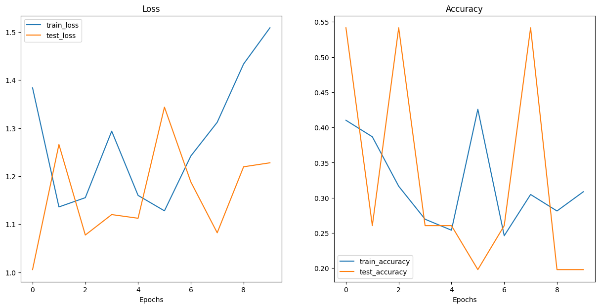
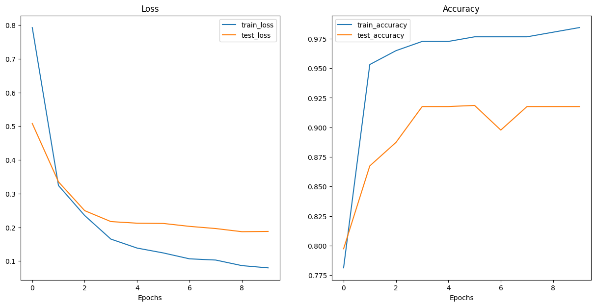

# Vision Transformer (ViT) Project

## Overview
This project is a reproduction of the Vision Transformer (ViT) paper. It involves training a ViT model from scratch on a dataset of food items (pizza, steak, sushi) and using transfer learning with a pretrained ViT model on the same dataset. Additionally, the project incorporates agricultural datasets (potatoes, tomatoes, peppers) to further demonstrate the model's capabilities.

## Project Structure
- `data/`: Contains training and testing data.
- `src/`: Source code for data setup, utilities, model definitions, training, and evaluation.
- `ViT_arc/`: Contains the reproduced ViT architecture.
- `requirements.txt`: List of dependencies.
- `README.md`: Project documentation.

## Setup

### Prerequisites
- Python 3.8+
- PyTorch
- torchvision
- Other dependencies listed in `requirements.txt`

### Installation
1. Clone the repository:
   ```bash
   git clone https://github.com/SumeetChougule/ViT-Paper-Replication.git
   cd ViT-Paper-Replication

2. Install the required packages:
   ```bash
   pip install -r requirements.txt

### USAGE

#### Data Preparation
1. Download and preprocess the data:
   ```bash
   python src/data_setup.py

#### Training
##### From-Scratch Model - Train the ViT model from scratch:
   ```bash
    python training_ViT.py
```

##### Pretrained Model - Train the pretrained ViT model:
   ```bash
    python pretrained_ViT.py
```


### Results

This section presents the performance of the Vision Transformer (ViT) models trained on our dataset. We compare the results of training a ViT model from scratch with those of using a pretrained ViT model and fine-tuning it on the same dataset.

#### From-Scratch Model

The from-scratch ViT model was trained on a small dataset consisting of images of food items (pizza, steak, sushi). Given the limited size of the dataset, the training and testing loss and accuracy curves exhibit some variability.

##### Training and Testing Loss



- **Train Loss**: The training loss decreases but rises again and keeps flutuating. Our model is severely underfitting due to the smaller dataset.
- **Test Loss**: The test loss is all over the place.

##### Training and Testing Accuracy

- **Accuracy**: Accuracy is bad due to the lack of larger dataset.


#### Pretrained Model

The pretrained ViT model was fine-tuned on the same dataset. By leveraging the pre-existing knowledge from a larger dataset, this model achieves better performance and stability.

##### Training and Testing Loss



- **Train Loss**: The training loss for the pretrained model decreases more rapidly and stabilizes at a lower value.
- **Test Loss**: The test loss also decreases smoothly, indicating better generalization and less underfitting.

##### Training and Testing Accuracy

![Pretrained Model]

- **Train Accuracy**: The training accuracy of the pretrained model reaches higher values more quickly, demonstrating the benefit of transfer learning.
- **Test Accuracy**: The test accuracy is consistently higher and more stable, indicating better performance on unseen data.

### Visualizations and Comparisons

- The loss and accuracy plots for both the from-scratch and pretrained models provide a clear visual representation of their training progress.
- The pretrained model outperforms the from-scratch model in terms of both training and test accuracy, showcasing the effectiveness of transfer learning.

These results highlight the advantages of using pretrained models, especially when working with small datasets. By including these visualizations and comparisons, we can effectively demonstrate the improvements achieved through transfer learning and the capabilities of the ViT architecture.
